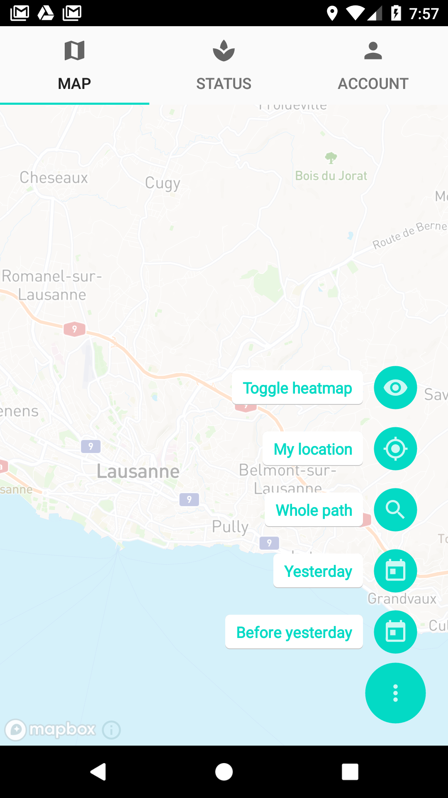
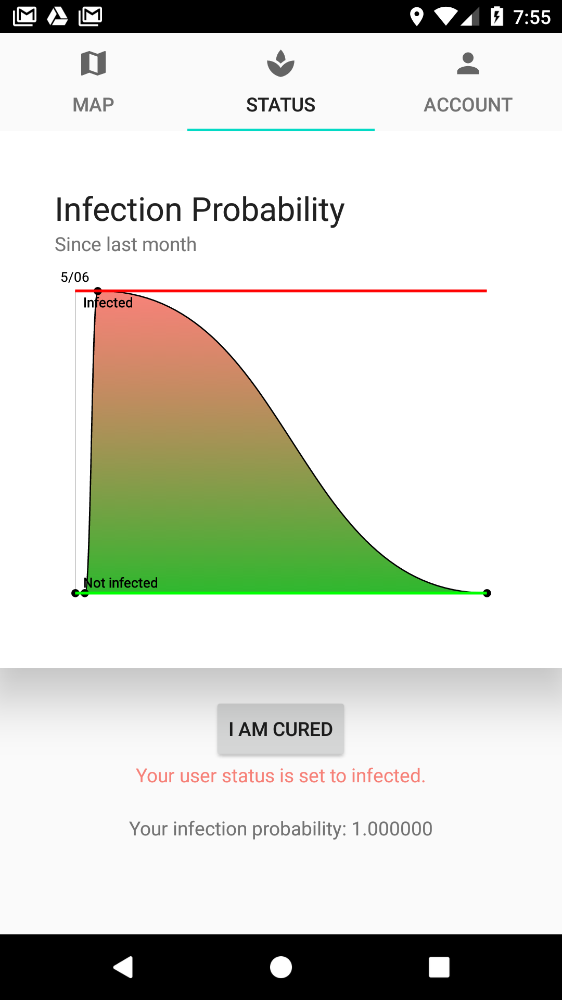
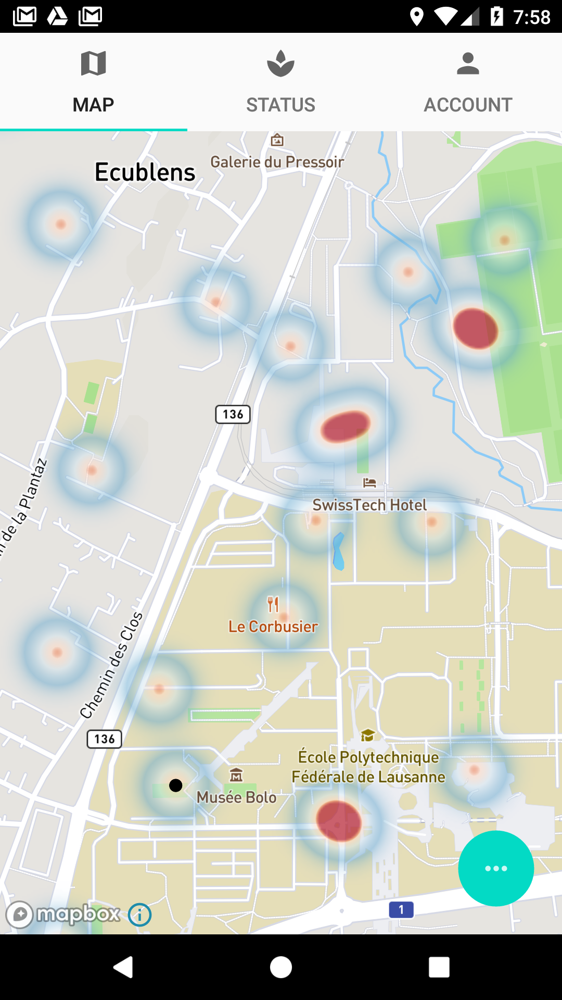

#  Virus Tracker 
Software Development Project 2020

> The main goal is to help control the spread by having more insight on it.  
> It is made for everyone to use. 
> The contamination analysis is mainly based on distance estimation between different users, and meeting occurrences with (potentially) infected users.  
> We chose to make the app parametrizable with respect to the actual contamination factor and infection probability, as we can't pretend to know the actual numbers. 
>
> NB: this app needs a GPS position to work properly, you won't be able to use it in a bunker!

 

## App structure
Once you log into  the app, you can see 3 different tabs: Map, Status & Account.

### Map
Is a... map containing 5 feature buttons described below.

* Toggle heatmap: show infected areas around you. If you zoom in/out too much, you won't be able to see it anymore. That way, you cannot see the precise location of infected users (privacy friendly). 

* My location: when your fingers got lost on the map, click to see where you are on the map. 

* Whole path: you are able to see the paths you made yesterday and the day before it, to have more insight on which infected areas you've been close too. This button allows you to show the whole path on the map, from starting point to ending point. NB: you need to have clicked on a path to show first (see next 2 buttons). 

* Yesterday: click here to see your path from yesterday. 

* Before yesterday: click here to see your path from the day before yesterday. 

  

### Status
Concerns the user infection status.
It contains a graph showing your infection probability, and a button to report your infection. You are allowed to change your infection status at most once per day. 

  

### Account
Contains your user informations and the tab where you can sign out and clear your history. 

  

## Little story about the name CoronaGame
> CoronaGame was the initial name for a virus spreading game, supposed to help creating a model for virus spreading. Given the rapid evolution of the current coronavirus situation, we chose to adapt and created Virus Tracker. 

<!--Badges-->

